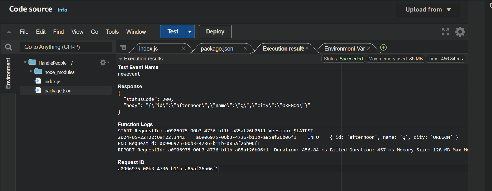
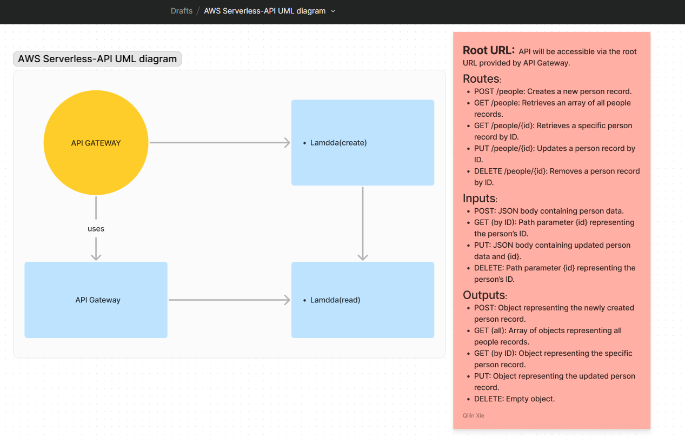

# serverless-api
Create a single resource REST API using a domain model, constructed using AWS Cloud Services.

## Screenshots
- Lambda Execution results: 

- POST/people [POST Folder](POST)

- GET/PEOPLE [GET Folder](GET-ID)

- GET/PEOPLE/ID [GET ID FOLDER](GET-ID)

- PUT/People/ID [PUT-ID FOLDER](PUT-ID)
 
- DELETE/PEOPLE/ID [Delete FOLDER](DeletebyID)

## UML: 

## Routes
- POST /people
  - **Input**: JSON body with `id`, `name`, `city`.
  - **Output**: Object representing the created record.
  
- GET /people
  - **Output**: Array of all records.

- GET /people/{id}
  - **Output**: Object representing the record with the given id.

- PUT /people/{id}
  - **Input**: JSON body with fields to update.
  - **Output**: Object representing the updated record.

- DELETE /people/{id}
  - **Output**: Empty object.
