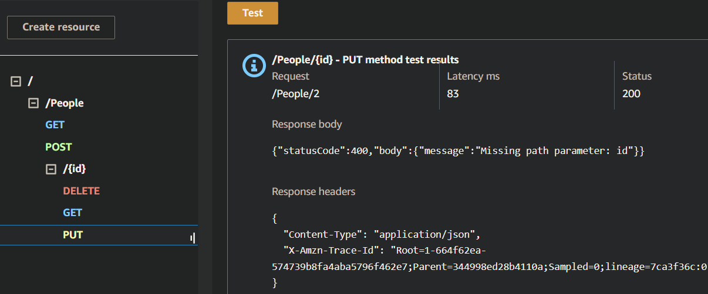

# serverless-api
Create a single resource REST API using a domain model, constructed using AWS Cloud Services.

## Screenshots

- 1. POST/people [POST Folder](POST) :

- 2. GET/PEOPLE [GET Folder](GET-ID) :

- 3. GET/PEOPLE/ID [GET ID FOLDER](GET-ID): 

- 4. PUT/People/ID [PUT-ID FOLDER](PUT-ID):  and 
 
- 5. DELETE/PEOPLE/ID [Delete FOLDER](DeletebyID): 

* CURD operations are not updated in their respective folders

## UML: 

## Routes
- POST /people
  - **Input**: JSON body with `id`, `name`, `city`.
  - **Output**: Object representing the created record.
  
- GET /people
  - **Output**: Array of all records.

- GET /people/{id}
  - **Output**: Object representing the record with the given id.

- PUT /people/{id}
  - **Input**: JSON body with fields to update.
  - **Output**: Object representing the updated record.

- DELETE /people/{id}
  - **Output**: Empty object.
